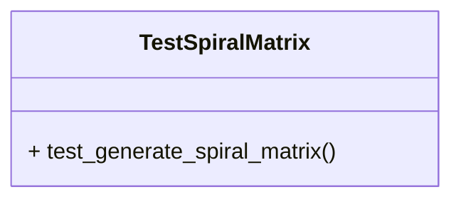
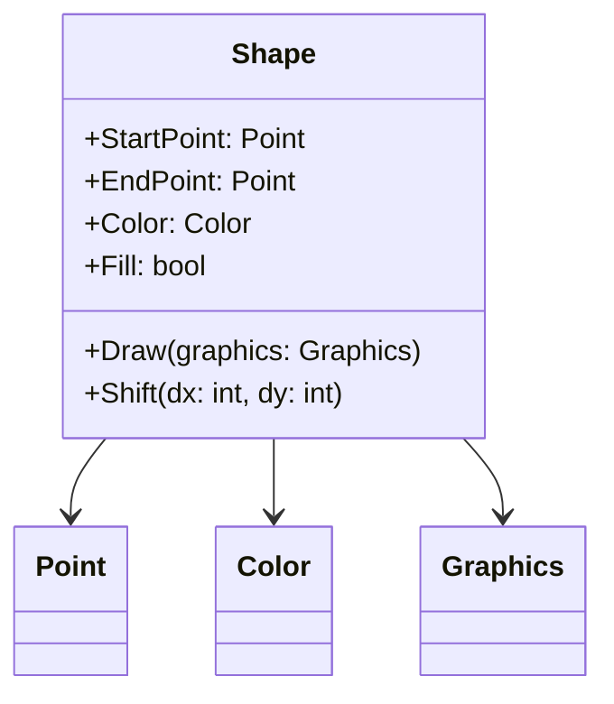
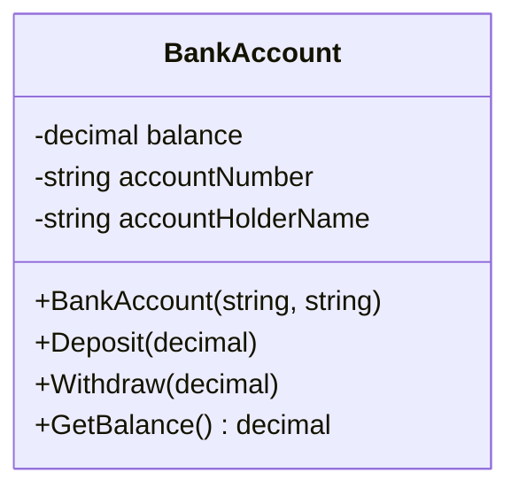
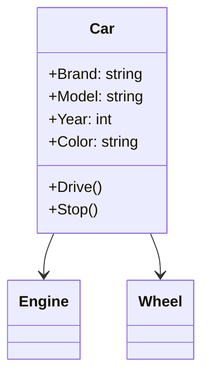

положительный результат тестирования:

***диаграмма класса теста:***

```mermaid
classDiagram
class TestSpiralMatrix {
    + test_generate_spiral_matrix()
}
```

***диаграмма второго класса:***

```mermaid
classDiagram
    class Shape {
        +StartPoint: Point
        +EndPoint: Point
        +Color: Color
        +Fill: bool
        +Draw(graphics: Graphics)
        +Shift(dx: int, dy: int)
    }
    class Point
    class Color
    class Graphics
    Shape --> Point
    Shape --> Color
    Shape --> Graphics
```

***диаграмма третьего класса:***

```mermaid
classDiagram
    class BankAccount {
        -decimal balance
        -string accountNumber
        -string accountHolderName
        +BankAccount(string, string)
        +Deposit(decimal)
        +Withdraw(decimal)
        +GetBalance() decimal
    }
```

***диаграмма четвертого класса:***

```mermaid
classDiagram
    class Car {
        +Brand: string
        +Model: string
        +Year: int
        +Color: string
        +Drive()
        +Stop()
    }
    class Engine
    class Wheel
    Car --> Engine
    Car --> Wheel
```
